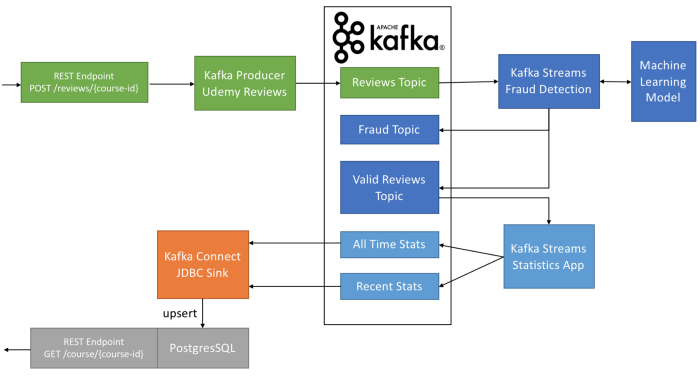

[](https://app.codacy.com/gh/felipegutierrez/explore-kafka?utm_source=github.com&utm_medium=referral&utm_content=felipegutierrez/explore-kafka&utm_campaign=Badge_Grade)
[](https://travis-ci.com/felipegutierrez/explore-kafka)
[](https://codecov.io/gh/felipegutierrez/explore-kafka)
[](https://www.codefactor.io/repository/github/felipegutierrez/explore-kafka)


Using [Kafka 2.6.0](http://kafka.apache.org/) to implement and practice the exercises from the Apache Kafka Series:

 - [Learn Apache Kafka for Beginners v2](https://www.udemy.com/course/kafka-connect/)
 - [Kafka Connect Hands-on Learning](https://www.udemy.com/course/kafka-connect/)
 - [Confluent Schema Registry & REST Proxy](https://www.udemy.com/course/confluent-schema-registry/)
 - [Kafka Cluster Setup & Administration](https://www.udemy.com/course/kafka-cluster-setup/)
 - [Kafka Streams for Data Processing](https://www.udemy.com/course/kafka-streams/)

## Implementing an end-to-end Kafka pipeline
This assigment is to deploy an end-to-end Stream pipeline which uses Kafka Producer and Consumer, Kafka Connect, Kafka Sink, and Kafka Stream. Instructions are available on the blog post [How to use Apache Kafka to transform a batch pipeline into a real-time one](https://medium.com/@stephane.maarek/how-to-use-apache-kafka-to-transform-a-batch-pipeline-into-a-real-time-one-831b48a6ad85).



### SETUP
Download Confluent Platform 5.1.1 [https://www.confluent.io/download/](https://www.confluent.io/download/). Unzip and add confluent-5.1.1/bin to your PATH. Download and install Docker for Mac / Windows / Linux and execute.
```
$ sudo docker-compose up -d
Creating network "explore-kafka_default" with the default driver
Pulling postgres (postgres:9)...
9: Pulling from library/postgres
75cb2ebf3b3c: Pull complete
3ca6415d2bca: Pull complete
ac08e6372a7b: Pull complete
b4394fce95ce: Pull complete
6edcd5da08e3: Pull complete
3380dcb7db08: Pull complete
c7c147d9c90d: Pull complete
08ae47fef758: Pull complete
33ee4df8dc9d: Pull complete
e6e96cb19c77: Pull complete
959f56bf087e: Pull complete
60ff707cab6b: Pull complete
a9d63251e2a1: Pull complete
171cc6d2cbaa: Pull complete
Digest: sha256:2f75145ad0773308263d33b60ed811c0640a3497c01187059235a9ba46ccdf15
Status: Downloaded newer image for postgres:9
Creating explore-kafka_postgres_1 ... done
```
Start the confluent platform.
```
$ cd /home/felipe/Servers/confluent-5.5.1
$ ./bin/confluent local start
    The local commands are intended for a single-node development environment
    only, NOT for production usage. https://docs.confluent.io/current/cli/index.html

Using CONFLUENT_CURRENT: /tmp/confluent.pgPs0oxa
Starting zookeeper
zookeeper is [UP]
Starting kafka
kafka is [UP]
Starting schema-registry
schema-registry is [UP]
Starting kafka-rest
kafka-rest is [UP]
Starting connect
connect is [UP]
Starting ksql-server
ksql-server is [UP]
Starting control-center
control-center is [UP]
```
Delete and create all the topics we're going to use for this demo.
```
./bin/kafka-topics --delete --topic udemy-reviews --zookeeper localhost:2181
./bin/kafka-topics --delete --topic udemy-reviews-valid --zookeeper localhost:2181
./bin/kafka-topics --delete --topic udemy-reviews-fraud --zookeeper localhost:2181
./bin/kafka-topics --delete --topic long-term-stats --zookeeper localhost:2181
./bin/kafka-topics --delete --topic recent-stats --zookeeper localhost:2181

./bin/kafka-topics --create --topic udemy-reviews --partitions 3 --replication-factor 1 --zookeeper localhost:2181
./bin/kafka-topics --create --topic udemy-reviews-valid --partitions 3 --replication-factor 1 --zookeeper localhost:2181
./bin/kafka-topics --create --topic udemy-reviews-fraud --partitions 3 --replication-factor 1 --zookeeper localhost:2181
./bin/kafka-topics --create --topic long-term-stats --partitions 3 --replication-factor 1 --zookeeper localhost:2181
./bin/kafka-topics --create --topic recent-stats --partitions 3 --replication-factor 1 --zookeeper localhost:2181

./bin/kafka-topics --list --zookeeper localhost:2181
```
Build and package the different project components (make sure you have maven installed)
```
/home/felipe/workspace-idea/explore-kafka
mvn clean package
```
### PLAYING
### Step 1: Review Producer
Start an avro consumer on our reviews topic
```
./bin/kafka-avro-console-consumer --topic udemy-reviews --bootstrap-server localhost:9092
```
And launch our first producer in another terminal !
```
export COURSE_ID=1075642  # Kafka for Beginners Course
cd /home/felipe/workspace-idea/explore-kafka
java -jar kafka-schema-registry-avro-V1/target/kafka-schema-registry-avro-V1-1.0.jar -app 3
```
This pulls overs 1000 reviews with some intentional delay of 50 ms between each send, so you can see it stream in your consumer.
### Step 2: The Kafka stream fraud detector
Launch the fraud detector in another terminal.
```
cd /home/felipe/workspace-idea/explore-kafka
java -jar kafka-streams-basics/target/kafka-streams-basics-1.0.jar -app 2

# sample output:
KafkaStreamUdemyFraudDetector - Valid: 29560326
KafkaStreamUdemyFraudDetector - !! Fraud !!: 29567558
KafkaStreamUdemyFraudDetector - Valid: 29569624
KafkaStreamUdemyFraudDetector - Valid: 29575044
KafkaStreamUdemyFraudDetector - Valid: 29575286
KafkaStreamUdemyFraudDetector - !! Fraud !!: 29577702
KafkaStreamUdemyFraudDetector - Valid: 29578162
KafkaStreamUdemyFraudDetector - Valid: 29580356
KafkaStreamUdemyFraudDetector - Valid: 29580626
KafkaStreamUdemyFraudDetector - Valid: 29581252
KafkaStreamUdemyFraudDetector - Valid: 29584788
```
### Step 3: Reviews Aggregator with Kafka Streams
Launche the consumers.
```
$ cd /home/felipe/Servers/confluent-5.5.1
$ ./bin/kafka-avro-console-consumer --topic recent-stats --bootstrap-server localhost:9092 --from-beginning
$ ./bin/kafka-avro-console-consumer --topic long-term-stats --bootstrap-server localhost:9092 --from-beginning
```
Launch the Kafka stream aggregator of reviews and observe the out put on the consumers launched before.
```
cd /home/felipe/workspace-idea/explore-kafka
java -jar kafka-streams-basics/target/kafka-streams-basics-1.0.jar -app 3
```
output of the topic `recent-stats`:
```
{"course_id":1075642,"course_title":"Apache Kafka Series - Learn Apache Kafka for Beginners v2","average_rating":4.663373860182371,"count_reviews":1316,"count_five_stars":840,"count_four_stars":400,"count_three_stars":60,"count_two_stars":8,"count_one_star":8,"count_zero_star":0,"last_review_time":253402210800000,"sum_rating":6137.0}
{"course_id":1075642,"course_title":"Apache Kafka Series - Learn Apache Kafka for Beginners v2","average_rating":4.664294367050273,"count_reviews":3302,"count_five_stars":2111,"count_four_stars":996,"count_three_stars":156,"count_two_stars":22,"count_one_star":17,"count_zero_star":0,"last_review_time":253402210800000,"sum_rating":15401.5}
```
output of the topic `long-term-stats`:
```
{"course_id":1075642,"course_title":"Apache Kafka Series - Learn Apache Kafka for Beginners v2","average_rating":4.667444161718971,"count_reviews":7074,"count_five_stars":4470,"count_four_stars":2220,"count_three_stars":327,"count_two_stars":39,"count_one_star":18,"count_zero_star":0,"last_review_time":253402210800000,"sum_rating":33017.5}
{"course_id":1075642,"course_title":"Apache Kafka Series - Learn Apache Kafka for Beginners v2","average_rating":4.664912693280028,"count_reviews":17009,"count_five_stars":10718,"count_four_stars":5338,"count_three_stars":812,"count_two_stars":96,"count_one_star":45,"count_zero_star":0,"last_review_time":253402210800000,"sum_rating":79345.5}
{"course_id":1075642,"course_title":"Apache Kafka Series - Learn Apache Kafka for Beginners v2","average_rating":4.665220596574799,"count_reviews":17634,"count_five_stars":11114,"count_four_stars":5535,"count_three_stars":838,"count_two_stars":100,"count_one_star":47,"count_zero_star":0,"last_review_time":253402210800000,"sum_rating":82266.5}
{"course_id":1075642,"course_title":"Apache Kafka Series - Learn Apache Kafka for Beginners v2","average_rating":4.6651093767175995,"count_reviews":18194,"count_five_stars":11444,"count_four_stars":5739,"count_three_stars":864,"count_two_stars":100,"count_one_star":47,"count_zero_star":0,"last_review_time":253402210800000,"sum_rating":84877.0}
{"course_id":1075642,"course_title":"Apache Kafka Series - Learn Apache Kafka for Beginners v2","average_rating":4.664631545270343,"count_reviews":18754,"count_five_stars":11781,"count_four_stars":5935,"count_three_stars":888,"count_two_stars":102,"count_one_star":48,"count_zero_star":0,"last_review_time":253402210800000,"sum_rating":87480.5}
{"course_id":1075642,"course_title":"Apache Kafka Series - Learn Apache Kafka for Beginners v2","average_rating":4.664725069897484,"count_reviews":19314,"count_five_stars":12140,"count_four_stars":6106,"count_three_stars":914,"count_two_stars":104,"count_one_star":50,"count_zero_star":0,"last_review_time":253402210800000,"sum_rating":90094.5}
```
### Step 4: Kafka Connect Sink — Exposing that data back to the users
Load the JDBC Sink Kafka connector
```
$ confluent local load SinkTopics -- -d explore-kafka/kafka-connect-docker/src/main/resources/code/sink/demo-postgres/SinkTopicsInPostgres.properties 
    The local commands are intended for a single-node development environment
    only, NOT for production usage. https://docs.confluent.io/current/cli/index.html

{
  "name": "SinkTopics",
  "config": {
    "connector.class": "io.confluent.connect.jdbc.JdbcSinkConnector",
    "tasks.max": "3",
    "connection.url": "jdbc:postgresql://localhost:5432/postgres",
    "connection.user": "postgres",
    "connection.password": "postgres",
    "insert.mode": "upsert",
    "pk.mode": "record_value",
    "pk.fields": "course_id",
    "auto.create": "true",
    "topics": "recent-stats,long-term-stats",
    "key.converter": "org.apache.kafka.connect.storage.StringConverter",
    "name": "SinkTopics"
  },
  "tasks": [],
  "type": "sink"
}
```
Install some PostgreSQL client to visualize the data.
```
# Create the file repository configuration:
sudo sh -c 'echo "deb http://apt.postgresql.org/pub/repos/apt $(lsb_release -cs)-pgdg main" > /etc/apt/sources.list.d/pgdg.list'

# Import the repository signing key:
wget --quiet -O - https://www.postgresql.org/media/keys/ACCC4CF8.asc | sudo apt-key add -

# Update the package lists:
sudo apt update

# Install the latest version of PostgreSQL.
# If you want a specific version, use 'postgresql-12' or similar instead of 'postgresql':
sudo apt install postgresql
$ psql --host=localhost --port=5432 --username=postgres 
Password for user postgres: 
psql (12.3 (Ubuntu 12.3-1.pgdg18.04+1), server 9.6.18)
Type "help" for help.

$ psql --host=localhost --port=5432 --username=postgres 
Password for user postgres: 
psql (12.3 (Ubuntu 12.3-1.pgdg18.04+1), server 9.6.18)
Type "help" for help.

postgres=# \l
                                 List of databases
   Name    |  Owner   | Encoding |  Collate   |   Ctype    |   Access privileges   
-----------+----------+----------+------------+------------+-----------------------
 postgres  | postgres | UTF8     | en_US.utf8 | en_US.utf8 | 
 template0 | postgres | UTF8     | en_US.utf8 | en_US.utf8 | =c/postgres          +
           |          |          |            |            | postgres=CTc/postgres
 template1 | postgres | UTF8     | en_US.utf8 | en_US.utf8 | =c/postgres          +
           |          |          |            |            | postgres=CTc/postgres
(3 rows)

postgres=# \c postgres
psql (12.3 (Ubuntu 12.3-1.pgdg18.04+1), server 9.6.18)
You are now connected to database "postgres" as user "postgres".
postgres=# \dt
              List of relations
 Schema |      Name       | Type  |  Owner   
--------+-----------------+-------+----------
 public | long-term-stats | table | postgres
 public | recent-stats    | table | postgres
(2 rows)

postgres=# \d recent-stats
                              Table "public.recent-stats"
      Column       |            Type             | Collation | Nullable |    Default    
-------------------+-----------------------------+-----------+----------+---------------
 course_id         | bigint                      |           | not null | '-1'::integer
 course_title      | text                        |           |          | ''::text
 average_rating    | double precision            |           | not null | 
 count_reviews     | bigint                      |           |          | 0
 count_five_stars  | bigint                      |           |          | 0
 count_four_stars  | bigint                      |           |          | 0
 count_three_stars | bigint                      |           |          | 0
 count_two_stars   | bigint                      |           |          | 0
 count_one_star    | bigint                      |           |          | 0
 count_zero_star   | bigint                      |           |          | 0
 last_review_time  | timestamp without time zone |           | not null | 
 sum_rating        | double precision            |           | not null | 
Indexes:
    "recent-stats_pkey" PRIMARY KEY, btree (course_id)

postgres=# \d long-term-stats
                             Table "public.long-term-stats"
      Column       |            Type             | Collation | Nullable |    Default    
-------------------+-----------------------------+-----------+----------+---------------
 course_id         | bigint                      |           | not null | '-1'::integer
 course_title      | text                        |           |          | ''::text
 average_rating    | double precision            |           | not null | 
 count_reviews     | bigint                      |           |          | 0
 count_five_stars  | bigint                      |           |          | 0
 count_four_stars  | bigint                      |           |          | 0
 count_three_stars | bigint                      |           |          | 0
 count_two_stars   | bigint                      |           |          | 0
 count_one_star    | bigint                      |           |          | 0
 count_zero_star   | bigint                      |           |          | 0
 last_review_time  | timestamp without time zone |           | not null | 
 sum_rating        | double precision            |           | not null | 
Indexes:
    "long-term-stats_pkey" PRIMARY KEY, btree (course_id)

postgres=# select * from "recent-stats";
 course_id |                       course_title                        |  average_rating  | count_reviews | count_five_stars | count_four_stars | count_three_stars | count_two_stars | count_one_star | count_zero_star |  last_review_time   | sum_rating 
-----------+-----------------------------------------------------------+------------------+---------------+------------------+------------------+-------------------+-----------------+----------------+-----------------+---------------------+------------
   1075642 | Apache Kafka Series - Learn Apache Kafka for Beginners v2 | 4.66452344931921 |          5288 |             3382 |             1592 |               252 |              36 |             26 |               0 | 9999-12-30 23:00:00 |      24666
(1 row)

postgres=# select * from "long-term-stats";
 course_id |                       course_title                        |  average_rating  | count_reviews | count_five_stars | count_four_stars | count_three_stars | count_two_stars | count_one_star | count_zero_star |  last_review_time   | sum_rating 
-----------+-----------------------------------------------------------+------------------+---------------+------------------+------------------+-------------------+-----------------+----------------+-----------------+---------------------+------------
   1075642 | Apache Kafka Series - Learn Apache Kafka for Beginners v2 | 4.66490830967544 |         26066 |            16400 |             8212 |              1235 |             149 |             70 |               0 | 9999-12-30 23:00:00 |   121595.5
(1 row)
```

### Step 5: Play some more
Make sure the four components are running (you can shut down the consumers) and fire off more producers
```
export COURSE_ID=1141696  # Kafka Connect Course
cd /home/felipe/workspace-idea/explore-kafka
java -jar kafka-schema-registry-avro-V1/target/kafka-schema-registry-avro-V1-1.0.jar -app 3

export COURSE_ID=1141702  # Kafka Setup and Administration Course
java -jar kafka-schema-registry-avro-V1/target/kafka-schema-registry-avro-V1-1.0.jar -app 3

export COURSE_ID=1294188  # Kafka Streams Course
java -jar kafka-schema-registry-avro-V1/target/kafka-schema-registry-avro-V1-1.0.jar -app 3
```
### Step 6: Clean up
```
cd /home/felipe/workspace-idea/explore-kafka
sudo docker-compose down
confluent local destroy
```

### Other applications
All the other applications implemented on this project:
```
mvn clean package
java -jar kafka-basics/target/kafka-basics-1.0.jar -app [1|2|3|4|5|6]
java -jar kafka-twitter/target/kafka-twitter-1.0.jar -app 1 -elements "corona|covid|covid-19"
java -jar kafka-elasticsearch/target/kafka-elasticsearch-1.0.jar -app [1|2|3|4]
java -jar kafka-streams-basics/target/kafka-streams-basics-1.0.jar -app [1|2]
java -jar kafka-source-connector-github/target/kafka-source-connector-github-1.0.jar -app [1]
java -jar avro-examples/target/avro-examples-1.0.jar -app [1|2|3|4]
java -jar kafka-schema-registry-avro-V1/target/kafka-schema-registry-avro-V1-1.0.jar -app [1|2|3]
java -jar kafka-schema-registry-avro-V2/target/kafka-schema-registry-avro-V2-1.0.jar -app [1|2]
```
### Troubleshooting
Start the zookeeper:
```
./bin/zookeeper-server-start.sh config/zookeeper.properties
```
Start the Kafka brokers
```
./bin/kafka-server-start.sh config/server.properties
```
Topics
```
./bin/kafka-topics.sh  --zookeeper localhost:2181 --list
./bin/kafka-topics.sh  --zookeeper localhost:2181 --create --topic twitter_tweets --partitions 6 --replication-factor 1
./bin/kafka-topics.sh  --zookeeper localhost:2181 --create --topic user-keys-and-colours --partitions 1 --replication-factor 1
./bin/kafka-topics.sh  --zookeeper localhost:2181 --create --topic favourite-colour-input --partitions 1 --replication-factor 1
./bin/kafka-topics.sh  --zookeeper localhost:2181 --create --topic favourite-colour-output --partitions 1 --replication-factor 1 --config cleanup.policy=compact
./bin/kafka-topics.sh  --zookeeper localhost:2181 --create --topic user-keys-and-colours-scala --partitions 1 --replication-factor 1
./bin/kafka-topics.sh  --zookeeper localhost:2181 --create --topic favourite-colour-output-scala --partitions 1 --replication-factor 1

./bin/kafka-topics.sh  --zookeeper localhost:2181 --describe --topic twitter_tweets
# Add, describe, delete configuration for a topic
./bin/kafka-configs.sh --zookeeper localhost:2181 --entity-type topics --entity-name twitter_tweets --describe
# min.insync.replicas=2 means that 2 nodes besides the leader has to synchronize the messages.
# However, because our --replication-factor=1 (because I tested on my local machine) the min.insync.replicas=2 has no efect
./bin/kafka-configs.sh --zookeeper localhost:2181 --entity-type topics --entity-name twitter_tweets --add-config min.insync.replicas=2  --alter
./bin/kafka-configs.sh --zookeeper localhost:2181 --entity-type topics --entity-name twitter_tweets --delete-config min.insync.replicas --alter
```
Log cleanup policies
```
./bin/kafka-topics.sh --zookeeper localhost:2181 --describe --topic __consumer_offsets
```
Start the producer from the command line or the Java producer Kafka application
```
./bin/kafka-console-producer.sh --broker-list localhost:9092 --topic first-topic --property parse.key=true --property key.separator=,
./bin/kafka-console-producer.sh --broker-list localhost:9092 --topic favourite-colour-input
```
Start the consumer with or without group and key-value properties
```
./bin/kafka-console-consumer.sh --bootstrap-server localhost:9092 --topic first-topic
./bin/kafka-console-consumer.sh --bootstrap-server localhost:9092 --topic first-topic --group my-first-app --property print.key=true --property key.separator=,
./bin/kafka-console-consumer.sh --bootstrap-server localhost:9092 --topic favourite-colour-output --from-beginning --formatter kafka.tools.DefaultMessageFormatter --property print.key=true --property print.value=true --property key.deserializer=org.apache.kafka.common.serialization.StringDeserializer --property value.deserializer=org.apache.kafka.common.serialization.LongDeserializer

```
