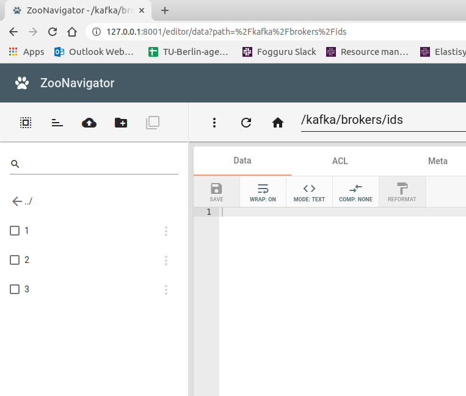

## Pre-requisites
Update and install packages
```
sudo apt-get update -y
sudo apt-get -y install wget ca-certificates zip net-tools vim nano tar netcat
```
Use Java Open JDK 8
```
sudo apt-get -y install openjdk-8-jdk
java -version
```
Disable RAM Swap - can set to 0 on certain Linux distro
```
sudo sysctl vm.swappiness=1
echo 'vm.swappiness=1' | sudo tee --append /etc/sysctl.conf
cat /etc/sysctl.conf
```
Add hosts entries (mocking DNS) - put relevant IPs here
```
127.0.0.1	localhost cow-11 kafka00 zookeeper00
192.168.56.1    cow-11 kafka00 zookeeper00
# Virtual Machines
192.168.56.101  worker01 kafka01 zookeeper01
192.168.56.102  worker02 kafka02 zookeeper02
192.168.56.103  worker03 kafka03 zookeeper03
```
## Zookeeper
 - Start Zookeeper as a service: [setup/setup-1-zookeeper-single-felipe.sh](setup/setup-1-zookeeper-single-felipe.sh)
 - Use the Zookeeper CLI: [zookeeper/zookeeper-shell-examples.sh](zookeeper/zookeeper-shell-examples.sh)
 - Set the zookeeper quorum: [setup/setup-2-zookeeper-quorum-felipe.sh](setup/setup-2-zookeeper-quorum-felipe.sh)
 - Use web tools [ZooNavigator](https://github.com/elkozmon/zoonavigator) on a machine without zookeeper: [setup/setup-3-tools.sh](setup/setup-3-tools.sh), [setup/setup-4-zoonavigator.sh](setup/setup-4-zoonavigator.sh) and access [http://127.0.0.1:8001](http://127.0.0.1:8001) using `zookeeper01:2181,zookeeper02:2181,zookeeper03:2181`.


## Kafka
 - Deploy a single [setup/setup-6-kafka-single.sh](setup/setup-6-kafka-single.sh) and the cluster [setup/setup-7-kafka-cluster.sh](setup/setup-7-kafka-cluster.sh) Kafka nodes on the VMs. After start the kafka you should see the kafka node on the Zoonavigator as the figure below is showing.


 - Moreover, you should see the child nodes in zookeeper.



```
flink@worker01:~/kafka$ bin/kafka-topics.sh --zookeeper zookeeper01:2181/kafka --create --topic first_topic --replication-factor 1 --partitions 3
WARNING: Due to limitations in metric names, topics with a period ('.') or underscore ('_') could collide. To avoid issues it is best to use either, but not both.
Created topic first_topic.

flink@worker01:~/kafka$ bin/kafka-console-producer.sh --broker-list kafka01:9092 --topic first_topic
>hi
>hello world
>kafka and zookeeper are a very good match
>zookeeper is a distributed key-value store necessary to handle Kafka topics
>^Cflink@worker01:~/kafka$ 

flink@worker01:~/kafka$ bin/kafka-console-consumer.sh --bootstrap-server kafka01:9092 --topic first_topic --from-beginning

zookeeper is a distributed key-value store necessary to handle Kafka topics
hello world
hi
kafka and zookeeper are a very good match
^CProcessed a total of 4 messages

flink@worker01:~/kafka$ bin/kafka-topics.sh --zookeeper zookeeper01:2181/kafka --list
__consumer_offsets
first_topic

flink@worker01:~/kafka$ bin/kafka-topics.sh --zookeeper zookeeper01:2181/kafka --topic first_topic --describe
Topic: first_topic	PartitionCount: 3	ReplicationFactor: 1	Configs: 
	Topic: first_topic	Partition: 0	Leader: 1	Replicas: 1	Isr: 1
	Topic: first_topic	Partition: 1	Leader: 2	Replicas: 2	Isr: 2
	Topic: first_topic	Partition: 2	Leader: 3	Replicas: 3	Isr: 3
```
 - now let's create a topic with replication factor of 3 [setup/setup-8-test-kafka-cluster.sh](setup/setup-8-test-kafka-cluster.sh)
```
flink@worker01:~/kafka$ bin/kafka-topics.sh --zookeeper zookeeper01:2181,zookeeper02:2181,zookeeper03:2181/kafka --create --topic second_topic --replication-factor 3 --partitions 3
WARNING: Due to limitations in metric names, topics with a period ('.') or underscore ('_') could collide. To avoid issues it is best to use either, but not both.
Created topic second_topic.
flink@worker01:~/kafka$ bin/kafka-console-producer.sh --broker-list kafka01:9092,kafka02:9092,kafka03:9092 --topic second_topic
>create topic with replaction factor of 3
>Kafka and zookeeper with 3 brokers running on my little cluter
>cluster
>that is awesome!
>

flink@worker02:~/kafka$ bin/kafka-console-consumer.sh --bootstrap-server kafka01:9092,kafka02:9092,kafka03:9092 --topic second_topic --from-beginning
Kafka and zookeeper with 3 brokers running on my little cluter
that is awesome!
create topic with replaction factor of 3
cluster

flink@worker03:~/kafka$ bin/kafka-topics.sh --zookeeper zookeeper01:2181,zookeeper02:2181,zookeeper03:2181/kafka --list

__consumer_offsets
first_topic
second_topic
flink@worker03:~/kafka$ 
flink@worker03:~/kafka$ bin/kafka-topics.sh --zookeeper zookeeper01:2181,zookeeper02:2181,zookeeper03:2181/kafka --topic second_topic --describe
Topic: second_topic	PartitionCount: 3	ReplicationFactor: 3	Configs: 
	Topic: second_topic	Partition: 0	Leader: 3	Replicas: 3,1,2	Isr: 3,1,2
	Topic: second_topic	Partition: 1	Leader: 1	Replicas: 1,2,3	Isr: 1,2,3
	Topic: second_topic	Partition: 2	Leader: 2	Replicas: 2,3,1	Isr: 2,3,1

```


