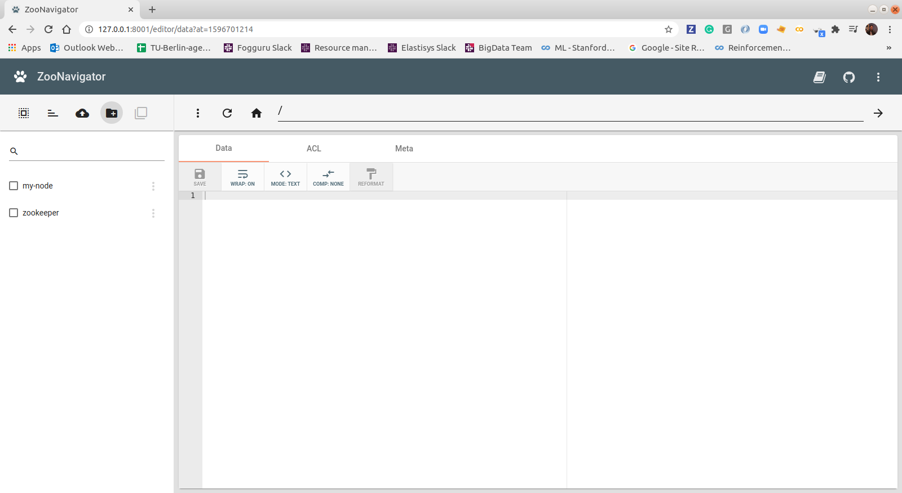
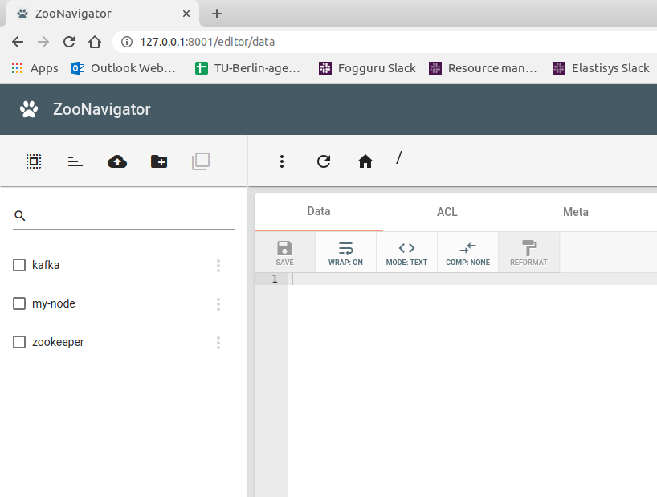
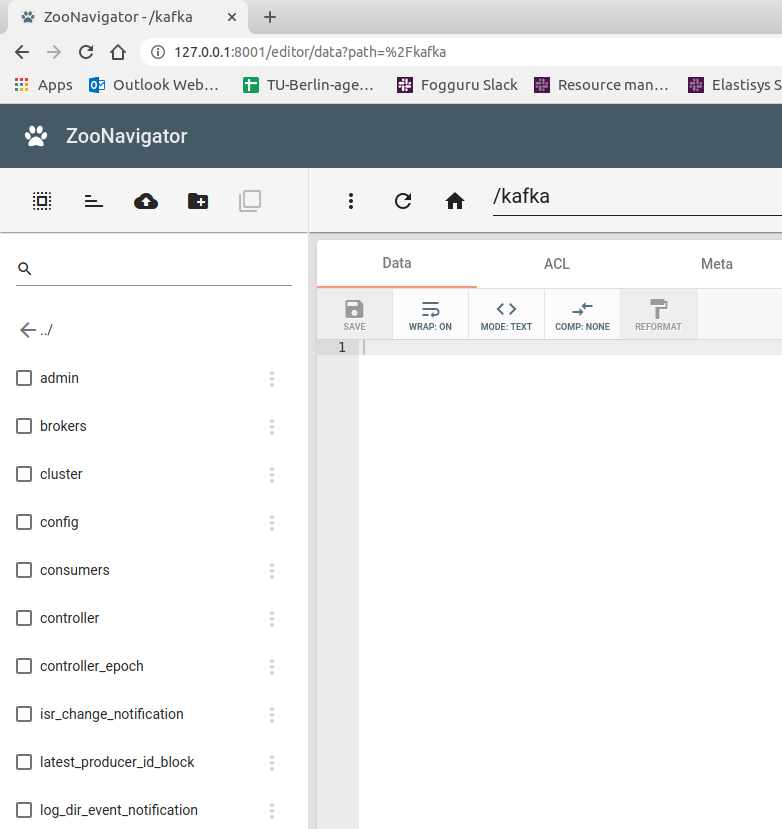

## Pre-requisites
Update and install packages
```
sudo apt-get update -y
sudo apt-get -y install wget ca-certificates zip net-tools vim nano tar netcat
```
Use Java Open JDK 8
```
sudo apt-get -y install openjdk-8-jdk
java -version
```
Disable RAM Swap - can set to 0 on certain Linux distro
```
sudo sysctl vm.swappiness=1
echo 'vm.swappiness=1' | sudo tee --append /etc/sysctl.conf
cat /etc/sysctl.conf
```
Add hosts entries (mocking DNS) - put relevant IPs here
```
127.0.0.1	localhost cow-11 kafka00 zookeeper00
192.168.56.1    cow-11 kafka00 zookeeper00
# Virtual Machines
192.168.56.101  worker01 kafka01 zookeeper01
192.168.56.102  worker02 kafka02 zookeeper02
192.168.56.103  worker03 kafka03 zookeeper03
```
## Zookeeper
 - Start Zookeeper as a service: [setup/setup-1-zookeeper-single-felipe.sh](setup/setup-1-zookeeper-single-felipe.sh)
 - Use the Zookeeper CLI: [zookeeper/zookeeper-shell-examples.sh](zookeeper/zookeeper-shell-examples.sh)
 - Set the zookeeper quorum: [setup/setup-2-zookeeper-quorum-felipe.sh](setup/setup-2-zookeeper-quorum-felipe.sh)
 - Use web tools [ZooNavigator](https://github.com/elkozmon/zoonavigator) on a machine without zookeeper: [setup/setup-3-tools.sh](setup/setup-3-tools.sh), [setup/setup-4-zoonavigator.sh](setup/setup-4-zoonavigator.sh) and access [http://127.0.0.1:8001](http://127.0.0.1:8001) using `zookeeper01:2181,zookeeper02:2181,zookeeper03:2181`.


## Kafka
 - Deploy a single [setup/setup-6-kafka-single.sh](setup/setup-6-kafka-single.sh) and the cluster [setup/setup-7-kafka-cluster.sh](setup/setup-7-kafka-cluster.sh) Kafka nodes on the VMs. After start the kafka you should see the kafka node on the Zoonavigator as the figure below is showing. Moreover, you should see the child nodes in zookeeper.




