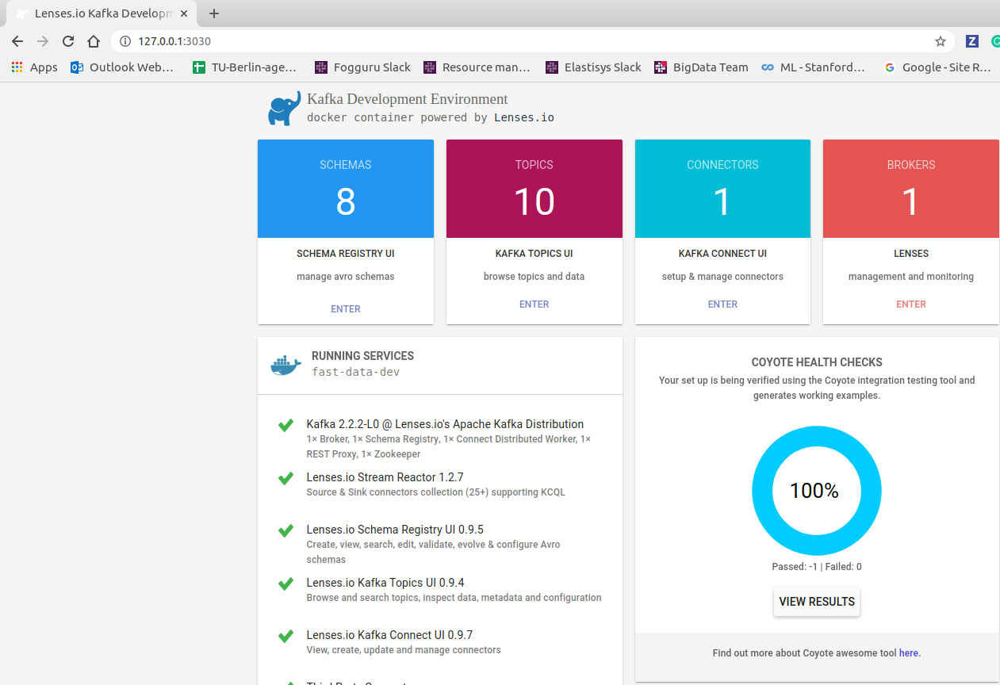
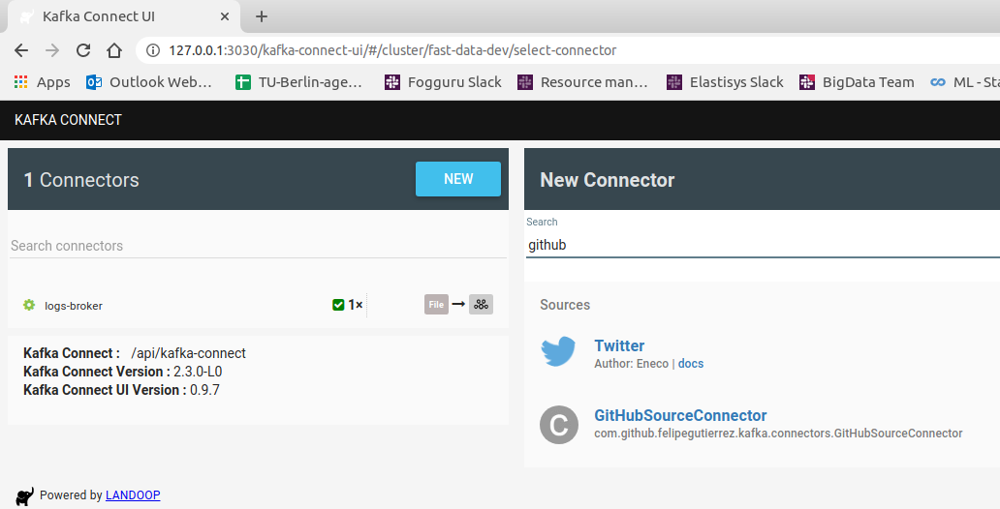
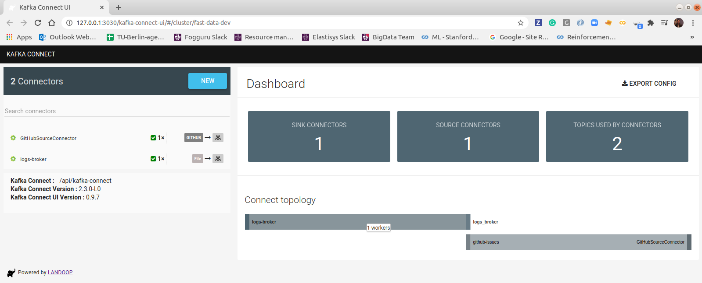
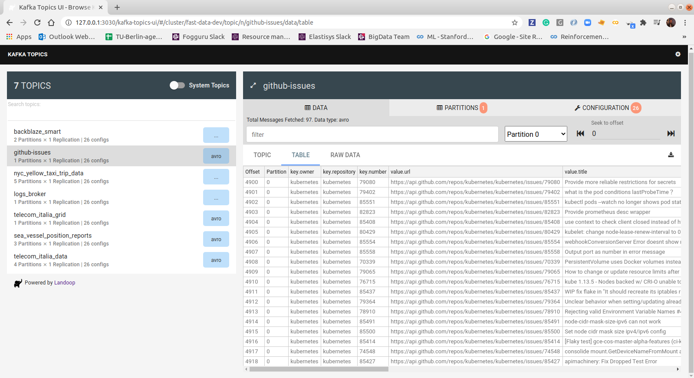

# kafka-source-connector-github

This code is based on the repository [https://github.com/simplesteph/kafka-connect-github-source](https://github.com/simplesteph/kafka-connect-github-source).


```
mvn clean package
sudo docker run -it --rm -p 2181:2181 -p 3030:3030 -p 8081:8081 -p 8082:8082 -p 8083:8083 -p 9092:9092 -e ADV_HOST=127.0.0.1 -e RUNTESTS=0 \
    -v /home/felipe/workspace-idea/explore-kafka/kafka-source-connector-github/target/kafka-source-connector-github-1.0:/connectors/GitHub \
    lensesio/fast-data-dev:2.3.0
```

Access the Landoop Kafka Development Environment at [http://127.0.0.1:3030/](http://127.0.0.1:3030/). Access the log service file [http://127.0.0.1:3030/logs/connect-distributed.log](http://127.0.0.1:3030/logs/connect-distributed.log) for errors. You should see one connector alive as it is shown on the figure below.






Then configure the new github source connector.




The `github-issues` topic is available and consumming data.




